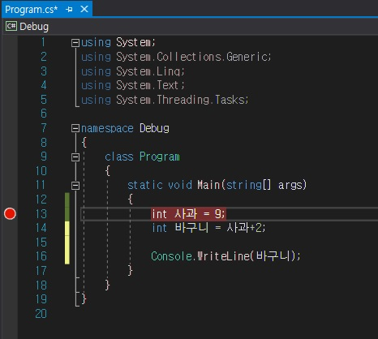

# 디버그란?
프로그램의 문제점을 없애는 것을 디버그라고 부릅니다.

프로그램의 동작 하나씩 따라가면서 데이터의 변동을 확인하면서 잘못된 값을 확인하여
프로그램의 오류를 확인한다.

현재 비주얼 스튜디오에는 매우 편리한 디버깅 기능이 있습니다.

## 중단점 
중단점은 프로그램 실행을 특정 지점에서 잠시 중단 시키기 위해 설정하는 지시자라고 합니다.

중단점 설정/해재 : F9
중단점을 설정한 곳을 빨간 중단정 표시가 생깁니다.

그럼 !! 저희는 디버깅을 할 준비가 된겁니다. :)

중단점이 생긴 상태에서 저희는 F5 를 누르면 디버깅을 시작하게 됩니다.

디버깅이 동작되면 중단점에 체크된 부분에서 멈추게 됩니다.

